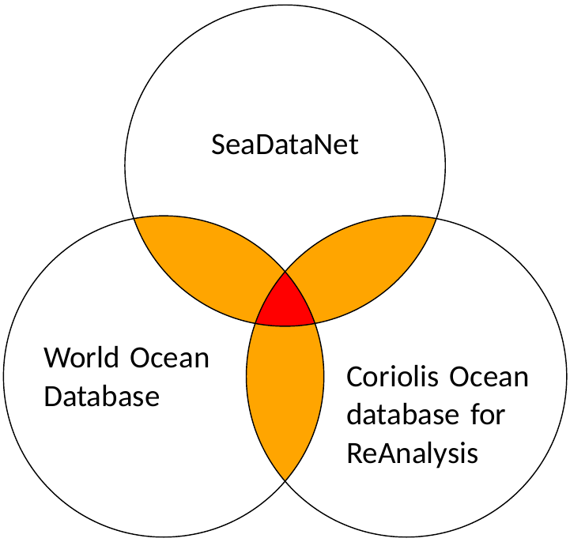
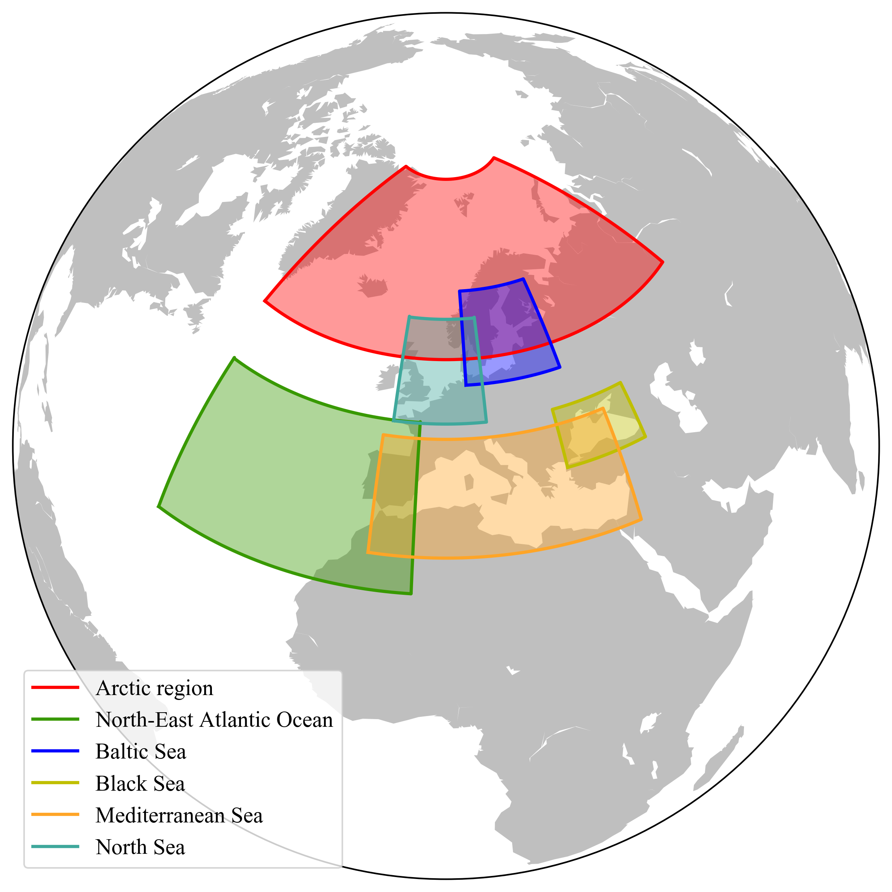
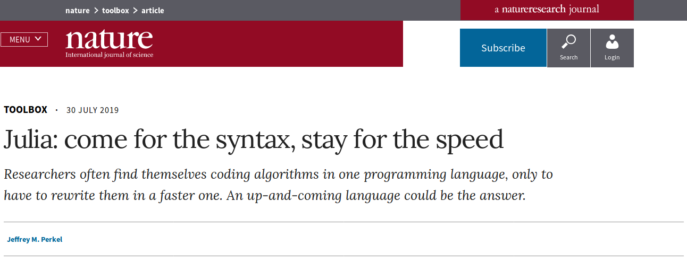
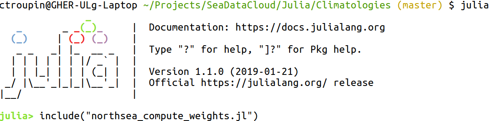

## Recommendation for the preparation of products


### File and variable naming

`DIVA` and `DIVAnd` have been adapted to accept file and variable names with white spaces. However it is recommended to avoid them, for example by substituting the white spaces with underscores.

```
Sea water temperature → Sea_water_temperature
```

Note that issues can arise from the white spaces when using *Thredds* data server.

### Keep things simple

Both `DIVA` and `DIVAnd` offer a large amount of tools and sophisticated options (variable correlation length, detrending, advection) that can improve the final results.

However it is recommended to always start with a simple application (constant parameters, no advection, no data transformation etc) to ensure things are working as expected and the results make sense.

### Harmonisation

The goal is to ensure consistency, taking into account the regional specificities.     
Main axis:
1. Data sources,
2. Interpolation tool,
3. Procedure and parameters.

#### Data sources

Try to have a consistent approach: same dataset(s) for each region and a comparable method for the duplicate removal.



* Which data source(s)?
* Which version for each dataset?
* How to eliminate **duplicates**?

#### Domain choice

1. Final users tend to prefer simple, *rectangular* domains, i.e. delimited by lines of constant longitudes or latitudes.
2. If merged products have to be created, it is necessary to ensure that we can have a smooth transition between them.



If there is a need for a domain delimitation following the irregular shapes, it may be relevant to have post-processing tools provided to the interested users.

#### Duplicate removal
The proposed procedure is as follows:
1. Use `ODV` to remove the duplicates based on the metadata.
2. With `DIVAnd`, run the duplicate check
```julia
dupl = DIVAnd.Quadtrees.checkduplicates(
    (obslon1,obslat1, obsdepth1, obstime1), obsval1,
    (obslon2,obslat2, obsdepth2, obstime1), obsval2,
    (Δlon, Δlat, Δdepth, Δtime), Δval);
```
with *reasonable* values for the Δ parameters (values below which two data points are considered as duplicates).      
For instance:
- Δlon = Δlat = 0.01°
- Δdepth = 2 meters
- Δtime = 1 hour (units should be the same as `obstime`)
- Δval = 0.1°C (if you work with temperature).
3. Check the percentage of supposed duplicates with respect to the 1st dataset
```julia
ndupl = length(findall(.!isempty.(dupl)));
pcdupl = round(ndupl / length(obslon) * 100; digits=2);
```
4. Return to step 2 and modify the Δ parameters to see how they affect the percentage of duplicates.
5. Once you are confident with the results, combine the 2 (or more)
data sets, as explained in the notebook [90-full-analysis](https://github.com/gher-ulg/Diva-Workshops/blob/master/notebooks/3-Analysis/90-full-analysis.ipynb).

**Note:** the duplicate detection and removal is a tedious task and might require to look individually to some profiles.

#### Interpolation tool

* Julia version: >= 1.0 (now at 1.3)
* DIVAnd version: >= v2.1.0 (now at v2.5.1)

#### Procedure & parameters

**Domain:**         
Spatial resolution: depending on region     
Total time coverage: depending on region     
Decade definitions: consistency      
Vertical levels: consistency across regions      

**Basic parameters:**     
Bathymetry: GEBCO or EMODnet Bathymetry, resolution depending on domain      
Correlation length: optimized (if coverage allows)      
Noise-to-signal ratio: optimized (if coverage allows)      
Data weights: optional (check sensitivity on a few levels)      
Background field: to discuss (case by case)     

**Other parameters:**      
surfextend = true (vertical extension at surface)           
coeff_derivative2 = [0., 0., 10⁻⁸] (sensitivity test)       

### Speeding up things

Julia is already very fast!       
[Julia: come for the syntax, stay for the speed](https://www.nature.com/articles/d41586-019-02310-3)



#### Use memtofit in `diva3d`

Use optional parameters memtofit=100 (for example) in the diva3d call.
(+ add more details)

#### Don't forget

1. Packages are pre-compiled when a kernel is started      
2. Functions gets compiled during the 1st execution      
3. Some operations can be executed once and their results stored

#### Data reading

1. Read the original netCDF ODV file
```julia
obsval, obslon, obslat, obsdepth, obstime, obsid =
    NCODV.load(Float64, ODVfile1, "Water body salinity");
```
2. Re-write the data
```julia
DIVAnd.saveobs(obsfile, "Water body salinity", obsval,
   (obslon, obslat, obsdepth, obstime), obsid)
```
3. Use the newly written files for the climatologies
```julia
obsval1, obslon1, obslat1, obsdepth1, obstime1, obsid1 =
   DIVAnd.loadobs(Float64,obsfile,"Water body salinity");
```

Another option could be to write the data into `.jld` format.     
However this format is not always maintained from one version of Julia to the next.

#### Computing weights "offline"

Example (adapt paths and file names)
```julia
using DIVAnd
using JLD

datadir = "/data/SeaDataCloud/NorthSea/"
varname = "Salinity"
obsfile = joinpath(datadir, "NorthSea_obs.nc")
netcdfODV = joinpath(datadir, "data_from_SDC_NS_DATA_DISCRETE_TS_V1b.nc")
isfile(netcdfODV)
@info("Reading data from the observation file")
@time obsval,obslon, obslat, obsdepth, obstime,obsid = DIVAnd.loadobs(Float64,obsfile,varname)
@info("Total number of data points: $(length(obsval))");

@time rdiag=1.0./DIVAnd.weight_RtimesOne((obslon,obslat),(0.03,0.03));
@show maximum(rdiag),mean(rdiag)
save("northsea_weights.jld", "rdiag", rdiag);
```

#### Export the notebooks as `.jl` files

And run them in a terminal:
```julia
include(name_of_the_program.jl)
```       


