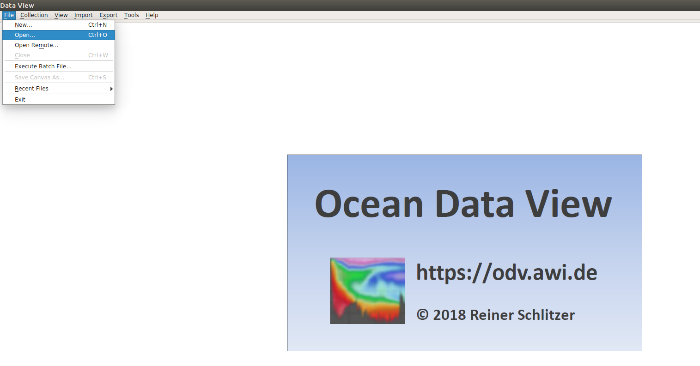
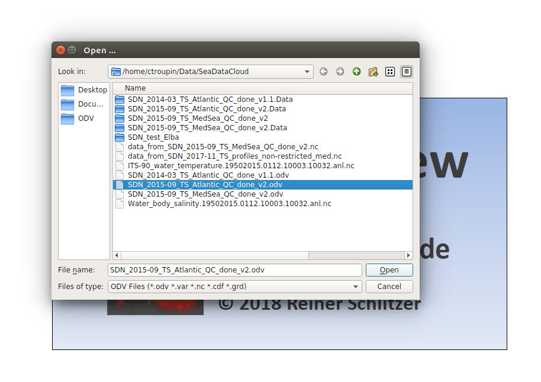
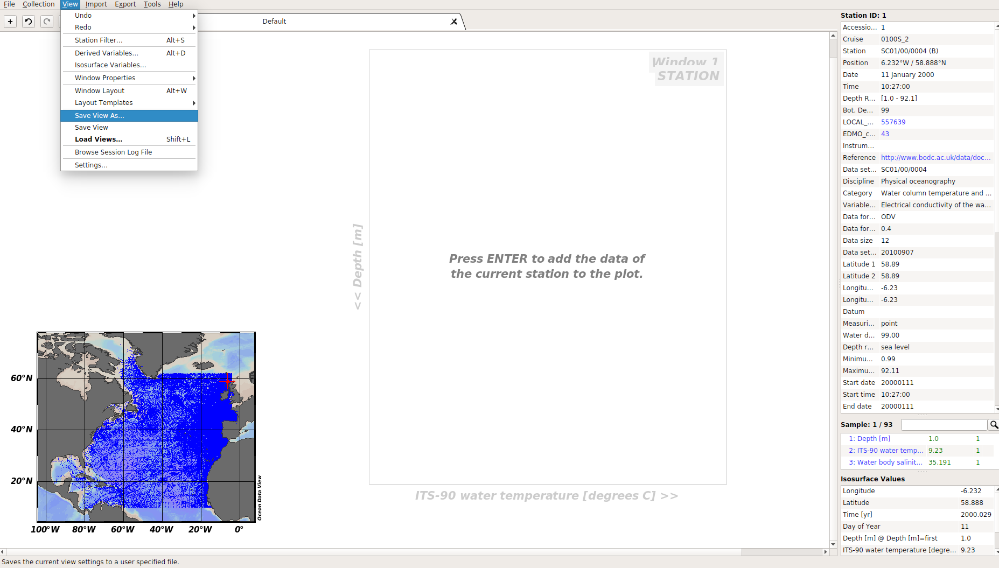
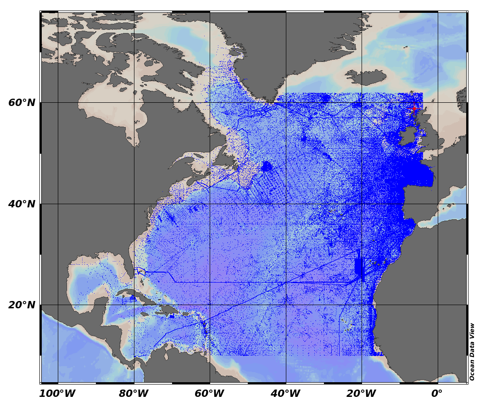
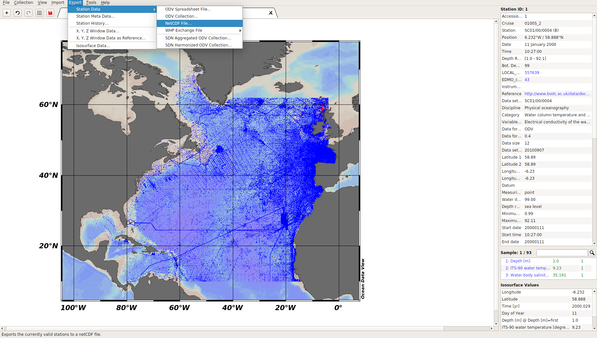
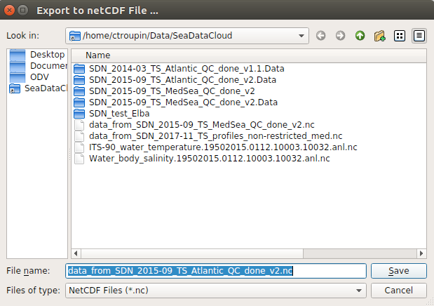
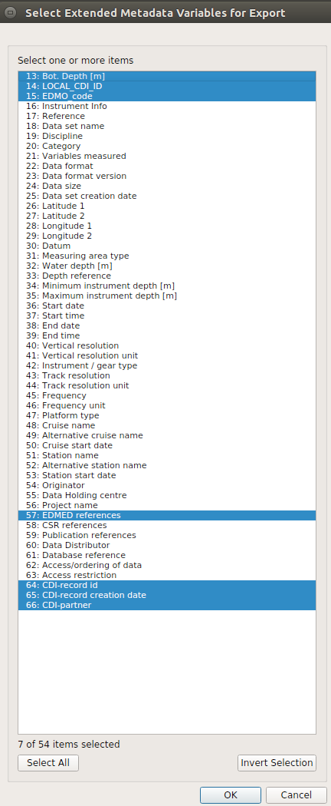
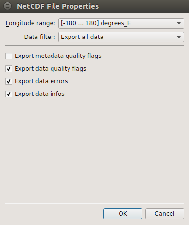

## netCDF export using Ocean Data View (ODV)

### ✅ Open ODV and click on the `Open`

### ✅ Select the ODV file (.odv extension)

### ✅ Check the data positions (map)

### ✅ Export > Station Data > NetCDF File...

### ✅ Indicate the name of the new netCDF file
By default, it is the same as the ODV file, but with a `.nc` extension

### ✅ Select the Extended Metadata variables
In case of doubt, take them all

### ✅ Select all the variables

### ✅ Modify the Longitude range if needed

### Run the export
🛈 This step can take up to a few minutes.     
We end up with a 992M netCDF file that we can use to produce a climatology.

You're done!
